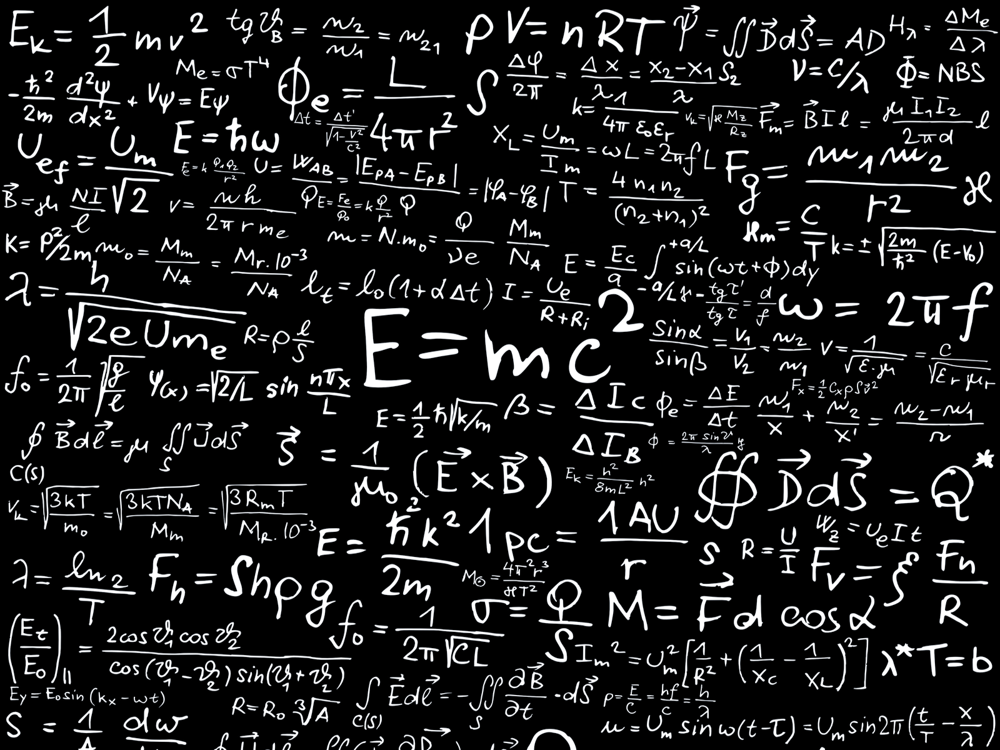

### II. What's a function?

#### Running Python scripts

    $ conda activate nanos
    $ ipython
    [1] odds = [n for n in range(10) if n % 2 == 1]
    [2] print("The first odds: ", odds)
    [3] odds. # press tab after the '.' and select 'count'
    [4] !ls # we can execute shell commands
    [5] %save odds.py 1-2
    [6] ?print
    [7]  ?
    [8]] %quickref # 'q' to quit, ctrl+up/down, /pattern, n/p
    [7] quit()
    $ python odds.py
    $ ipython qtconsole
    $ ipython --pylab

### Jupyter Notebooks

* Example 
https://nbviewer.jupyter.org/github/jakevdp/WhirlwindTourOfPython/blob/master/Index.ipynb

* Tutorial 
https://www.datacamp.com/community/tutorials/tutorial-jupyter-notebook

### Running Jupyter
        $ conda activate nanos
        $ conda install jupyter
        $ jupyter notebook . 

- Execute cell: Shift+Return

- How to add the nano kernel to jupyter
        $ conda install nb_conda
        $ conda install ipykernel
        $ ipython kernel install --user --name nanos --display-name "Python (nano)"
        $ jupyter kernelspec list
        $ jupyter kernelspec uninstall unwanted-kernel

### Jupyter Tools

- Post a notebook
    - https://nbviewer.jupyter.org/
    - Share on your github as an .ipynb file

- Jupyterize your github?
    - https://mybinder.org/

- Collaborate on a notebook (google docs)
    - https://colab.research.google.com/

#### Numpy ndarray

    import matplotlib.pyplot as plt

    img = plt.imread("panda-corner.jpg")
    type(img) # prints "numpy.ndarray"

    import numpy as np
    A = np.array([0, 1, 2, 3, 4])
    A.shape
    A[5] = 10 # Array index out of bounds!

#### Numpy basics

    import numpy as np

    A = [[1, 2, 3, 8],
        [2, 0, 3, 9],
        [0, 1, 3, 1]]

    B = [[3, 1], [4, 4], [6, 5], [2, 0]]
    
    X = np.matmul(A, B)
    X.T

    [1, 2, 3] * 2
    np.array([2, 3, 3]) * 2 + 5

    [1, 2, 3] + [2, 3, 4]
    np.array([1, 2, 3]) + np.array([2, 3, 4])

#### Numpy slicing
    B = np.zeros((3, 4, 5))
    C = B[:,:,0]
    C[0, 0, 0] # Can we do this with a regular array?

    A = [n for n in range(9)]
    A_2D = np.reshape(A, (3, 3))
    A_flat = np.reshape(A_2D, (9))
    A_2D.T

    B = np.arange(27)
    B_3D = B.reshape((3, 3, 3))
    B_flat = B_3D.reshape((3 * 3 * 3))
    B_3D.T

    vals = np.arange(10)
    vals = vals + 10
    idx = [2, 3, 5]
    vals[idx]

#### Lambdas

    # Lambda: short inline function

    add10 = lambda a: a + 10
    type(add10)
    print(add10(23))

    def compute(func, param):
        return func(param)
    
    print("Result: ", compute(add10, 13))

    add = lambda a, b: a + b

    def compute(func, *params): # using *args
        return func(*params)

    print("Result: ", compute(add, 13, 31))

#### Lambdas for a spin with maps

    plus10 = list(map(add10, range(10)))

    additions = list(map(add, [10, 20, 1, 2, 3], [30, 40, 3, 4, 5]))

    mapping = map(add10, range(10))
    for v in mapping: print(v)

    # lambdas are anonymous functions!
    squares = list(map(lambda a: a**2, range(5)))
    odds = list(map(lambda a: 2*a+1, range(5)))

    # Map: http://book.pythontips.com/en/latest/map_filter.html

#### Plotting a function with matplotlib
    import numpy as np
    import pylab as plt

    X = np.linspace(0,5,100)
    Y1 = X + 2*np.random.random(X.shape)
    Y2 = X**2 + np.random.random(X.shape)

    fig, ax = plt.subplots()
    ax.plot(X,Y1,'o')
    ax.plot(X,Y2,'x')
    plt.show()

#### Tutorial on plotting from matplotlib.org

    import matplotlib.pyplot as plt
    plt.plot([1, 2, 3, 4])
    plt.ylabel('some numbers')
    plt.show()

    # x,y
    plt.plot([1, 2, 3, 4], [1, 4, 9, 16])

    # x,y, red dots
    plt.plot([1, 2, 3, 4], [1, 4, 9, 16], 'ro')
    plt.axis([0, 6, 0, 20])
    plt.show()

#### Multiple plots on the same graph

    import numpy as np

    # evenly sampled time at 200ms intervals
    t = np.arange(0., 5., 0.2)

    # red dashes, blue squares and green triangles
    plt.plot(t, t, 'r--', t, t**2, 'bs', t, t**3, 'g^')
    plt.show()

#### Scatter plotting with different colors and sizes

    data = {'a': np.arange(50),
            'c': np.random.randint(0, 50, 50),
            'd': np.random.randn(50)}
    data['b'] = data['a'] + 10 * np.random.randn(50)
    data['d'] = np.abs(data['d']) * 100

    plt.scatter('a', 'b', c='c', s='d', data=data)
    plt.xlabel('entry a')
    plt.ylabel('entry b')
    plt.show()

#### Multiple figures

    def f(t):
        return np.exp(-t) * np.cos(2*np.pi*t)

    t1 = np.arange(0.0, 5.0, 0.1)
    t2 = np.arange(0.0, 5.0, 0.02)

    plt.figure(1)
    plt.subplot(211)
    plt.plot(t1, f(t1), 'bo', t2, f(t2), 'k')

    plt.subplot(212)
    plt.plot(t2, np.cos(2*np.pi*t2), 'r--')
    plt.show()

#### Annotating text

    ax = plt.subplot(111)

    t = np.arange(0.0, 5.0, 0.01)
    s = np.cos(2*np.pi*t)
    line, = plt.plot(t, s, lw=2)

    plt.annotate('local max', xy=(2, 1), xytext=(3, 1.5),
        arrowprops=dict(facecolor='black', shrink=0.05),
    )

    plt.ylim(-2, 2)
    plt.show()

#### Slope - rate of change

### m = (y2 - y1) / (x2 - x1)

- It's like a ladder
* m=1: for every step in X, we move one step in Y
* m=2: for every step in X, we move 2 steps in Y
* m=10: for every step in X, 10 steps in Y
* m=0.5: for every step in X, half a step in Y
* m=-1: for every step in X, one step back in Y

#### Slope

    %pylab
    X = np.linspace(-5,5,100)
    plt.plot(X, X**2-3*X+10)

    # Let's plot the slope for (4,14) - (3,10)
    # slope = (y2 - y1) / (x2 - x1) = (14-10) / (4-3) = 4
    plt.plot(X, 4*X) # Not quite there as the tangent

    plt.plot(X, 4*X-3) # Quite close!
    plt.plot(X, 4*X-2.4) # Quite close!

#### How do we find the minimum of a function?
    - By approximation. How? How many steps?

    Y = lambda x: x**2 - 3*x + 10
    plt.plot(X, Y(X))

    Pick 2 points, compute the slope
    p1 = (3, Y(3)) # 10?
    p2 = (4, Y(4)) # 14?
    slope = (p2[1] - p1[1]) / (p2[0] - p1[0])
    # slope = 4    # quite steep!
    plt.plot(X, X*slope)
    plt.plot(X, X*slope-2.4)
    plt.plot(X, X)

#### Let's go to the right?

    # How do we find out the zero slope?
    # Well, the slope is 4, very steep and positive.
    # For a "convex" function, we want to go opposite the slope direction

    step = -1
    p1 = (2, Y(2))
    p2 = (3, Y(3))
    slope = (p2[1] - p1[1]) / (p2[0] - p1[0])
    # slope = 2.0 # The slope has decreased! Keep going!
    plt.plot(X, slope*X)
    plt.plot(X, slope*X+4)

#### Let's keep searching for the minimum
    step = -2
    p1 = (0, Y(0))
    p2 = (1, Y(1))
    slope = (p2[1] - p1[1]) / (p2[0] - p1[0])
    # slope = -2  # Ooops. We are negative!
    plt.plot(X, X*slope) 

    step = +1
    p1 = (1, Y(1))
    p2 = (2, Y(2))
    slope = (p2[1] - p1[1]) / (p2[0] - p1[0])
    # slope = 0 
    plt.plot(X, slope*X)
    plt.plot(X, slope*X+8)

#### Are we there?
    # But there are many points with slope = 0
    # Let's get a "better" approximation to Min(x,Y(x))

    step=.49, .51
    p1 = (1.49, Y(1.49))
    p2 = (1.51, Y(1.51))
    slope = (p2[1] - p1[1]) / (p2[0] - p1[0])
    # slope = 0 # Still zero, but this point is closer to the truth
    # Guessing that the minimum is at (1.5, Y(1.5))?

    Algorithm
    Loop
        Compute the slope at current position
        Is the slope == 0, break
        Is the slope positive? go to the left
        Is the slope negative? go to the right

#### Slope competition

    Who will implement the "fastest" search 
    for the minimum given a lambda as an input. 
    "Fastest" is defined as the minimum number of 
    iterations to get the minimum.

    minimum, steps = find_minimum(some_lambda)

    (1.5, Y(1.5)), 10  # 10 steps to get estimate the minimum 1.5, Y(1.5))

    The challenge is to determine the "step" to determine the next 2 points to get the slope.

### ABC 

* EasyABC 
https://www.nilsliberg.se/ksp/easyabc/

* Examples 
http://abcnotation.com/examples

#### ABC Sample #1

    X:1
    T:Notes
    M:C
    L:1/4
    K:C
    C, D, E, F,|G, A, B, C|D E F G|A B c d|e f g a|b c' d' e'|f' g' a' b'|]

#### How to scrape resources from the web

* Machine learning depends on large amounts of data

* For music, let's google for ABC music files
* How we can we scrape for ABC music files? (discuss algorithm)

    For Chinese tunes:
    Hint: http://abcnotation.com/searchTunes?q=china

* How about for midi files?

#### Get the filename from a URL

    def getFilename(link):
        idx = link.rfind("/")
        idx = idx+1 if idx > -1 else 0
        return link[idx:]

    url = "https://news.ycombinator.com/y18.gif"
    filename = getFilename(url)

#### Download a resource from the web

    import urllib
    import os

    def downloadResource(url, folder):
        try:
            file = getFilename(url)
            path = os.path.join(folder, file)
            if os.path.exists(path):
                return # skip already downloaded files (maybe check size > 0?)
            urllib.request.urlretrieve(url, path)
        except:
            print("Failed for", url)

#### Download a web resource

    # Download an image
    url = "https://news.ycombinator.com/y18.gif
    downloadResource(url, "download")

    # Download the MP3
    url = "/getResource/resources/media/ai-erwa.mp3"
    downloadResource("http://abcnotation.com" + url, "download", "chinese.mp3")

    # Download an ABC song page
    url = "http://abcnotation.com/getResource/resources/media/ai-erwa.mp3?a=ifdo.ca/~seymour/runabc/esac/HAN2/0495/"
    downloadResource(url, "download")

    url = "/tunePage?a=ifdo.ca/~seymour/runabc/esac/HAN2/0495"
    downloadResource("http://abcnotation.com" + url, "download")

    # I'd rather save as HTML: "0495.html"
    downloadResource("http://abcnotation.com" + url, "download", "0495.html")

#### Add a default 'file' parameter

    def downloadResource(url, folder='.', name=None):
        try:
            file = name or getFilename(url)
            path = os.path.join(folder, file)
            if os.path.exists(path):
                return # skip already downloaded files (maybe check size > 0?)
            urllib.request.urlretrieve(url, path)
        except:
            print("Failed for", url)

    # Download an ABC song page
    url = "/tunePage?a=ifdo.ca/~seymour/runabc/esac/HAN2/0495"
    downloadResource("http://abcnotation.com" + url, "download", "0495.html")

#### Download the ABC song from the URL

    content = open("download/0495.html", 'r').read()
    abcStartTag = '<textarea cols="62" rows="13" readonly="readonly">'
    start = content.find(abcStartTag) + len(abcStartTag)
    end = content.find("</textarea>", start)

    abcSong = content[start:end].strip()
    print(abcSong, file=open('0495.abc', 'w'))

#### Skip saving the intermediate HTML page

    url = "/tunePage?a=ifdo.ca/~seymour/runabc/esac/HAN2/0495"
    req = urllib.request.urlopen("http://abcnotation.com" + url)
    content = req.read()

    abcStartTag = '<textarea cols="62" rows="13" readonly="readonly">'
    start = content.find(abcStartTag) + len(abcStartTag)
    end = content.find("</textarea>", start)

    abcSong = content[start:end]
    print(abcSong, file=open('0495.abc', 'w'))

#### Web scraper for ABC files for Chinese tunes?

    Go to the index search page (starting at s=0)
    url = "http://abcnotation.com/searchTunes?q=chinese&f=c&o=a&s=0"

    for each index_page
        find all links to song pages
        for each link in song pages:
            get the content of the song page
            retrieve the ABC song and save it

    The HTML structure looks so weird... 
    Maybe it's time for some beautiful soup!!

#### Beautiful Soup in Python

    # conda install -c anaconda beautifulsoup4
    from bs4 import BeautifulSoup

    # Song page
    html_doc = open('download/0495.html', 'r').read() 
    soup = BeautifulSoup(html_doc, 'html.parser')
    song = soup.find("textarea")
    links = soup.find_all('a')

    for link in links:
        print(link.get_text()) 

    # See: https://www.crummy.com/software/BeautifulSoup/bs4/doc/

#### Get all the abc links from the index search

    # Index page
    url = "http://abcnotation.com/searchTunes?q=chinese&f=c&o=a&s=0"
    downloadResource(url, "download", "chinese_index.html")
    html_doc = open('download/chinese_index.html', 'r').read() 
    soup = BeautifulSoup(html_doc, 'html.parser')

    abcLinks = []
    for link in soup.find_all('a'):
        if link.get_text().find("tune page") == 0:
            abcLinks.append(link.get('href'))
        if link.get_text() == "next":
            nextPage = link

### Reference

* For the serious scrapper
### https://scrapy.org/

- https://github.com/scrapy/scrapy

#### Music with Magenta.js

    Hello Magenta
    https://medium.com/@oluwafunmi.ojo/getting-started-with-magenta-js-e7ffbcb64c21
    https://hello-magenta.glitch.me/

    Melody Mixer
    https://experiments.withgoogle.com/ai/melody-mixer/view/
    https://github.com/googlecreativelab/melody-mixer

### Reference
- Colab
    - https://towardsdatascience.com/getting-started-with-google-colab-f2fff97f594c

- Python Tutorial
    https://docs.python.org/3/tutorial/
    https://www.learnpython.org/

### Matplotlib Reference

- Examples
    - https://matplotlib.org/examples/index.html
    - https://github.com/matplotlib/matplotlib

- Tutorial
    - https://matplotlib.org/tutorials/introductory/pyplot.html
    - https://matplotlib.org/tutorials/index.html
    - https://www.datacamp.com/community/tutorials/matplotlib-tutorial-python

### Animation with Matplotlib

- Animation with Matplotlib
https://jakevdp.github.io/blog/2012/08/18/matplotlib-animation-tutorial/

- Animation Examples
https://matplotlib.org/examples/animation/index.html

