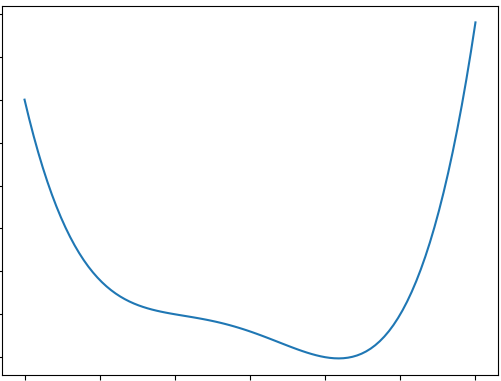

### 1. Numpy
Use numpy array commands to get the following matrix (3,3,3)

    array([[[ 5,  6,  7],
            [ 8,  9, 10],
            [11, 12, 13]],

        [[14, 15, 16],
            [17, 18, 19],
            [20, 21, 22]],

        [[23, 24, 25],
            [26, 27, 28],
            [29, 30, 31]]])

### 2. Numpy #2
Use numpy to get the following (2,2) matrix

    array([[20, 18, 16],
        [14, 12, 10],
        [ 8,  6,  4]])

### 3. Upsampling

One way to upsample is the following

        1 2  ---->  1 1  2 2
        3 4         1 1  2 2
                    3 3  4 4
                    3 3  4 4

Another one way is to fill up with zeros

        1 2  ---->  1 0  2 0
        3 4         0 0  0 0
                    3 0  4 0
                    0 0  0 0

Let's try the second approach and see the result.

First try out

    python 01_08_upsampling.py
    python 01_09_upsampling.v2.py

You can extend either of these or you can modify your existing solution.

Hint: It shouldn't be a lot of code changes, just 2 lines (one new line, one modified line)

The resulting image will look darker due to the zeros, how we can lighten it up?

### 4. Matplotlib
Use matplotlib. Determine good values for a,b,c

    X = np.linspace(a,b,c)
    Y = lambda x: x**4 - 3*x**3 + x**2 - 3*x + 10

    plt.plot(X, Y(X))
    plt.savefig('plot_pow4.png')

We want to reproduce this image of the function

### 6. ABC music

- Install EasyABC
- https://www.nilsliberg.se/ksp/easyabc/

- Try the following ABC songs
Exampes: http://abcnotation.com/examples

- Try the searching for interesting ABC folk songs
    irish
    polska
    mazurka
    pollonesse
    waltz
    wedding
    chinese

### 7. Papparazzi

Machine Learning depends on massive amounts of data. In this exercise, we'll learn how to chase images of celebrities.

For example, this is a large celebrity image dataset
http://mmlab.ie.cuhk.edu.hk/projects/CelebA.html

In the browser, visit: https://s3.amazonaws.com/cadl/celeb-align/000010.jpg

Likewise, try different other indexes
https://s3.amazonaws.com/cadl/celeb-align/000012.jpg

Extend the 02_02_papparazzi.py to download the first 100 celebrities

Remember we use the formatted strings for dynamic strings in python

    value = 33
    print(f"Please, repeat...{value}")

    quotes = {
        "matrix": "blue pill or red pill?"
    }
    print(f'Please, repeat...{quotes["matrix"]}')
