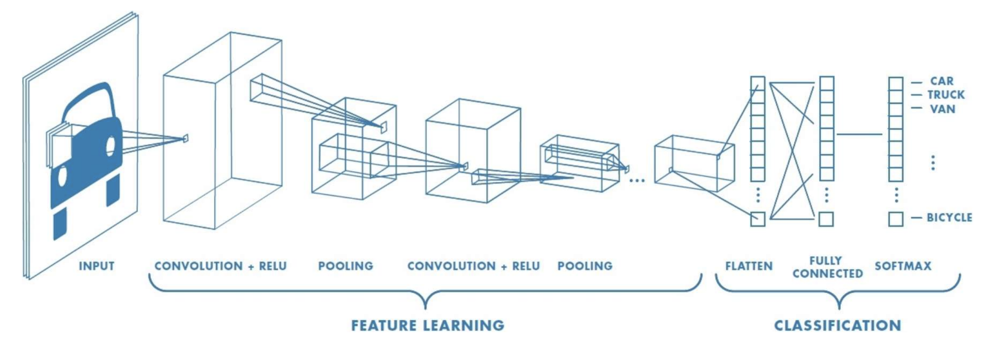

### IV. Image Classifiers

### Topics

* Normal Distribution
* Celebrity Database
* MNIST, CIFAR
* ml5.js Image Classifier

### Normal Distribution (Bell curve)

http://www.learningaboutelectronics.com/Articles/How-to-create-a-normal-distribution-plot-in-Python-with-numpy-and-matplotlib.php

    In a normal distribution, 68% of the data set will lie 
    within ±1 standard deviation of the mean. 95% of the data
    set will lie within ±2 standard deviations of the mean.
    And 99.7% of the data set will lie within ±3 standard
    deviations of the mean.

#### Graph of a Normal Distribution

    # So in the following code below, we create a normal 
    # distribution with a mean centered at 90, with a
    # standard deviation of 2, and 10000 (ten thousand)
    # random data points created. 

    import numpy as np
    import matplotlib.pyplot as plt

    values= np.random.normal(90,2,10000)
    plt.hist(values,50)
    plt.show()

#### More examples of a Normal Distribution

    # Mean: 50, stdev: 10
    values= np.random.normal(50,10,10000)
    plt.hist(values,50)
    plt.show()

    # Mean: -50, stdev: 5
    values= np.random.normal(-50,10,10000)
    plt.hist(values,50)
    plt.show()

#### Kadenze class

- Material verbatim from:
https://www.kadenze.com/courses/creative-applications-of-deep-learning-with-tensorflow/info

- Amazing free course (if you have some math and python)

#### Celebrity Image Dataset

    import matplotlib.pyplot as plt
    import numpy as np
    import os

    # Read the 100 downloaded celebrities in `celebrity_images`
    files = os.listdir("celebrity_images")
    img = plt.imread(os.path.join("celebrity_images", files[50]))
    img.shape
    plt.imshow(img)
    plt.show()

    img[0,0,0] # R for (0,0) pixel
    img[0,0,1] # G for (0,0) pixel
    img[0,0,2] # B for (0,0) pixel
    plt.imshow(img[:,:,0], cmap='gray') # Red channel to gray levels

* Python challenge: how can we load all the images into 'imgs' using list comprehensions?

#### Celebrity Statistics

    paths = [os.path.join("celebrity_images/", f) for f in files]
    imgs = [plt.imread(path) for path in paths]

    plt.imshow(imgs[3])
    plt.imshow(imgs[2])
    data = np.array(imgs)
    data.shape

    mean_img = np.mean(data, axis=0)
    plt.imshow(mean_img.astype(np.uint8))

    std_img = np.std(data, axis=0)
    plt.imshow(std_img.astype(np.uint8))
    plt.imshow(np.mean(std_img, axis=2).astype(np.uint8))

#### Celebrity pixel histogram

    flattened = data.ravel()
    flattened.shape
    100 * 218 * 178 * 3

    plt.close('all')
    plt.hist(flattened.ravel(), 255)

#### Plot celebrity statistics

    bins = 20
    fig, axs = plt.subplots(1, 3, figsize=(12, 6), sharey=True, sharex=True)

    # Original Image Data
    axs[0].hist((data[0]).ravel(), bins)
    axs[0].set_title('img distribution')

    # Mean Data
    axs[1].hist(mean_img.ravel(), bins)
    axs[1].set_title('mean distribution')

    # Difference (Data[0] - Mean) distribution
    axs[2].hist((data[0] - mean_img).ravel(), bins)
    axs[2].set_title('(img - mean) distribution')

#### Plot Normalized

    # 1. Difference (Data[0] - Mean) distribution
    axs[0].hist((data[0] - mean_img).ravel(), bins)
    axs[0].set_title('(img - mean) distribution')

    # 2. stdev
    axs[1].hist(std_img.ravel(), bins)
    axs[1].set_title('std deviation distribution')

    # 3. normalized
    axs[2].hist(((data[0] - mean_img) / std_img).ravel(), bins)
    axs[2].set_title('((img - mean) / std_dev) distribution')

    # A normalized distribution has what shape?
    axs[2].set_xlim([-150, 150])
    axs[2].set_xlim([-50, 50])
    axs[2].set_xlim([-10, 10])
    axs[2].set_xlim([-5, 5])

### Computer Vision

#### CNN: Convolutional Neural Networks
http://introtodeeplearning.com/

[Slides (Part 3)](http://introtodeeplearning.com/materials/2019_6S191_L3.pdf)

### CNN Layers

###### MIT 6.S191 Introduction to Deep Learning

### ReLU Activation

* Rectified Linear Unit
* g(z) = max(0, z)
* It replaces every negative pixel to 0

### MNIST
* Digit recognition
* MNIST Demo 
    - Demo: https://storage.googleapis.com/tfjs-examples/mnist/dist/index.html
    - Code: https://github.com/tensorflow/tfjs-examples/tree/master/mnist

* MNIST workshop with Tensorflow
    - https://github.com/aamini/introtodeeplearning_labs/blob/master/lab2/Part1_mnist_solution.ipynb

* http://neuralnetworksanddeeplearning.com/chap1.html

### CIFAR 10

* https://www.cs.toronto.edu/~kriz/cifar.html
* Data set for image classification
* 60,000 32x32 images in 10 classes.
* 6,000 images per class.
* 50,000 training images and 10,000 test images.
* Categories: airplane, bird, cat, deer, dog, horse, ship, truck

### Karpathy's Convnet.js

* MNIST
https://cs.stanford.edu/people/karpathy/convnetjs/demo/mnist.html

* CIFAR 10
https://cs.stanford.edu/people/karpathy/convnetjs/demo/cifar10.html

### ml5.js

* Posenet 
https://ml5js.org/docs/posenet-webcam

* Image classifier 
https://ml5js.org/docs/training-introduction

* Fast Style Transfer 
https://ml5js.org/docs/training-styletransfer

### Style Transfer

https://github.com/NVIDIA/FastPhotoStyle
https://blog.paperspace.com/art-with-neural-networks/

