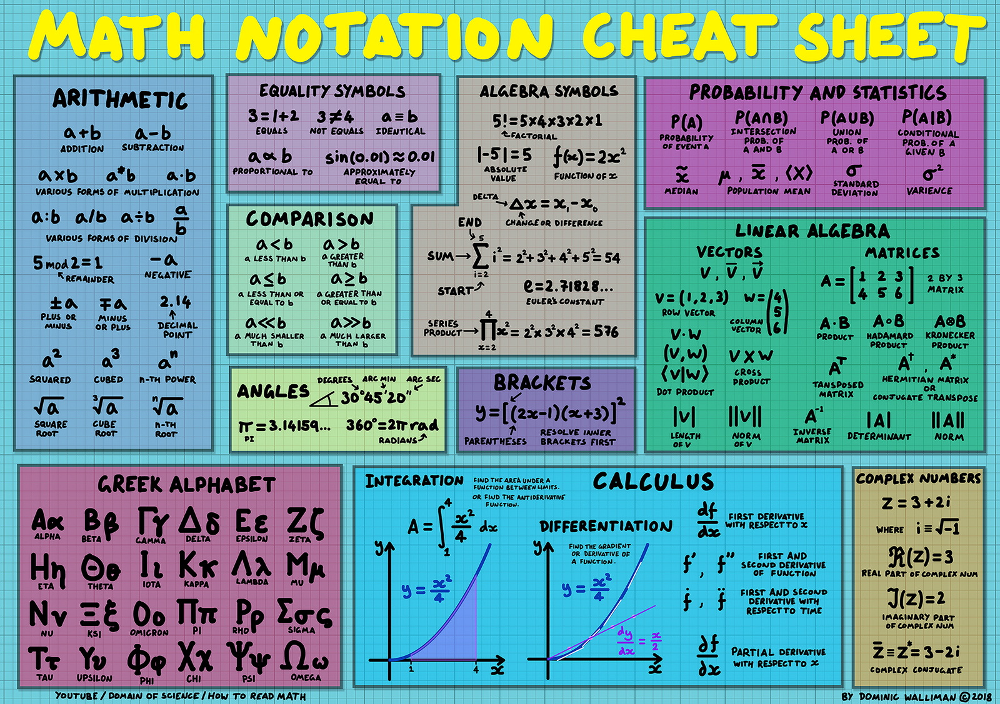

### Guide to Deep Learning for Teens in 6 Sessions

This course was prepared for the [Nanohacker](https://www.nanohackers.org/) community. Thanks to [Thoughtworks](https://www.thoughtworks.com/locations/new-york) for hosting our sessions!

    $ git clone https://github.com/deepdeepdot/nano-deep-learning.git
    $ cd nano-deep-learning

If you have python 2.7

    $ python -m SimpleHTTPServer

If you have python 3

    $ python -m http.server

### Overview

It requires proficiency in a programming language, say Ruby or Javascript.
Also, it assumes knowledge of basic git commands and github.
We'll cover some computer science topics like trees, functional 
programming using Python, and classes in Python.

Prerequisites
* Experience with programming
* Full stack web development

Math Cheatsheet https://www.flickr.com/photos/95869671@N08/40544016221

* Math concepts: matrix, functions, basic stats
* Programming with Python: images, plotting functions
* Intro to deep learning concepts
* Neural Networks: NN, CNN, RNN
* Overview of popular APIs
    - tensorflow, keras, pytorch
* Deep Learning with Javascript
    - ml5.js, magenta.js, tensorflow.js

### Sources

I decided not to recreate slides that have been wonderfully created by other free online course and also reuse much of the available online material on the net.

#### Tutorials
* https://www.kadenze.com/courses/creative-applications-of-deep-learning-with-tensorflow/info
* http://introtodeeplearning.com
* https://matplotlib.org

#### Slides
* Deep Learning: http://introtodeeplearning.com
* Tensorflow: http://web.stanford.edu/class/cs20si/syllabus.html

### Sections (tentative)

[Session #1: Matrix and Convolutions](01-nano-slides.md)
* Math: Matrix
* Image filters
* Python installation, running

[Session #2: Functions and Plotting](02-nano-slides.md)
* Jupyter notebooks and ipython
* Python: lambdas, map, numpy
* Plotting a function using matplotlib

[Session #3: Music Generation](03-nano-slides.md)
* Irish music generation using Deep Learning
* Scrapping ABC Music files
* Math: Slope of a function

[Session #4: Image Classifiers](04-nano-slides.md)
* Normal distribution
* Image classifiers: MNIST, CIFAR, ml5.js
* ml5.js

[Session #5: Text and Language](05-nano-slides.md)
* Binary tree and tree recursion
* Tensorflow as a computational graph
* Andrej Karpathy's RNN
* Magenta.js: Drum RNN
* Rasa, chatbot AI

[Session #6: Neural Networks](06-nano-slides.md)
* Tensorflow.js, api and demos
* Big picture of Deep Learning
* Deep Learning Problems
* Model Zoo
* Neural Networks

### Slides from IntroToDeepLearning.com

1) [NN, Neural Networks](http://introtodeeplearning.com/materials/2019_6S191_L1.pdf)
2) [CNN, Convolutional NN, Computer Vision](http://introtodeeplearning.com/materials/2019_6S191_L3.pdf)
3) [RNN, Recurrent NN, Sequence Modeling](http://introtodeeplearning.com/materials/2019_6S191_L2.pdf)

